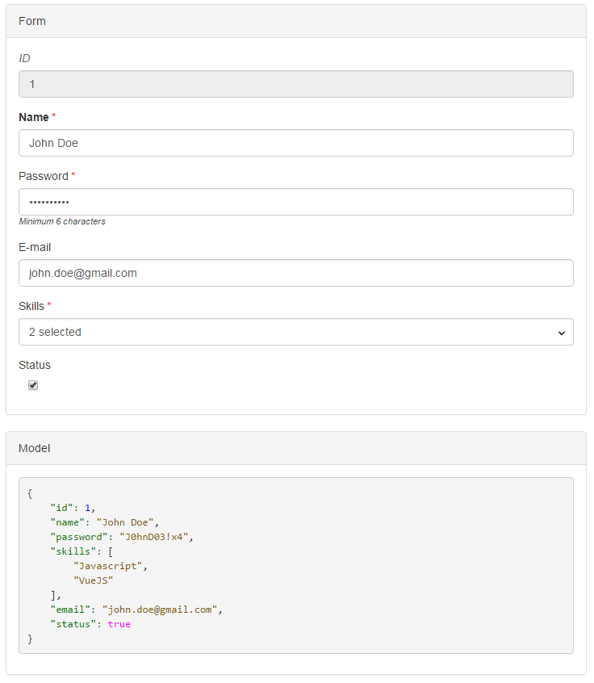

# VueFormGenerator

VueFormGenerator is a schema-based form generator component for [Vue.js](https://github.com/vuejs/vue)

## Demo

[JSFiddle simple example](https://jsfiddle.net/zoul0813/d8excp36/)

[CodePen simple example](https://codepen.io/zoul0813/pen/OrNVNw)

## Features

* multiple objects editing
* core & full bundles
* 21+ field types
* grouping fields
* built-in validators
* Bootstrap friendly templates
* customizable styles
* extendable with custom fields
* ...etc

## Documentation

[Link to documentation on Gitbook](https://vue-generators.gitbook.io/vue-generators/)

## More fields `*new*`

VueFormGenerator supports custom fields.  
If you decide to release your custom field into the wild, please [open a new issue](https://github.com/vue-generators/vue-form-generator/issues) so we can add you to a list here!  
Please try to use this naming convention for your custom field : `vfg-field-*`  
Example :

* `vfg-field-myfield`
* `vfg-field-calendar`
* `vfg-field-awesome-dropdown`

This way, it will be easier for everyone to find it. Thank you!

## License

vue-form-generator is available under the [MIT license](https://tldrlegal.com/license/mit-license).

## Contact

Copyright \(C\) 2016 Icebob

 

