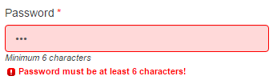

# Validation

Fields can have one or more validators, which validate user input.

### Examples

This "Age" field will output a numeric input field, and has uses the built-in `integer` validator:

```js
{
    type: "input",
    inputType: "number",
    label: "Age",
    model: "user_age",
    required: true,
    hint: "Age is required & must be a whole number.",
    validator: validators.integer
}
```

This password field uses the built-in `string` validator, with custom validation messages:

```js
{
    type: "input",
    inputType: "password",
    label: "Password",
    model: "password",
    min: 6,
    required: true,

    // String validator with custom error messages
    validator: validators.string.locale({
    	fieldIsRequired: "The password is required!",
    	textTooSmall: "Password must be at least {1} characters"
    })
}
```

This would look something like this:



## Setting a validator for a field

To set the validator for a field, you add a `validator:` property to its schema. The value of this property can be a function or a string, or an array of functions or strings.

### Use a function name

```js
{
    type: "input",
    inputType: "text",
    label: "Name",
    model: "name",
    min: 3,
    validator: validators.string
}
```

This can be any function name that's accessible/in-scope.


### Use a string

String values are just shortcuts for `validators.<function_name>`, i.e. this is equivalent to the above example:

```js
{
    type: "input",
    inputType: "text",
    label: "Name",
    model: "name",
    min: 3,
    validator: "string"
}
```
i.e. `validator: "string"` is just shorthand for `validator: validators.string`.

### Use an Array

If you want multiple validators for a field, you can specify an array of validators. They will be run in turn and any errors returned. The field will only validate if it passes all validators. The array can be an array of strings:

```js
{
    type: "input",
    inputType: "text",
    label: "Name",
    model: "name",
    min: 3,
    validator: ["string", "required"]
}

```

or function names:

```js
{
    type: "input",
    inputType: "text",
    label: "Name",
    model: "name",
    min: 3,
    validator: [validators.string, validators.required]
}

```


## Built in Validators

[A selection of common validators are built in and can be found here](built-in-validators.md).

## Custom Validators

You can create custom validators, which are just functions that take `value`, `field`, `model` parameters - and return either an array of errors, or an empty array if validation succeeds. [Full details on creating custom validators can be found here](custom-validators.md).

## Handling Validation Events

The `vue-form-generator` component emits a validated event, if validation is executed. The event parameters are: `isValid: boolean, errors: Array`. [Full details of handling validation events](validation-events.md).
